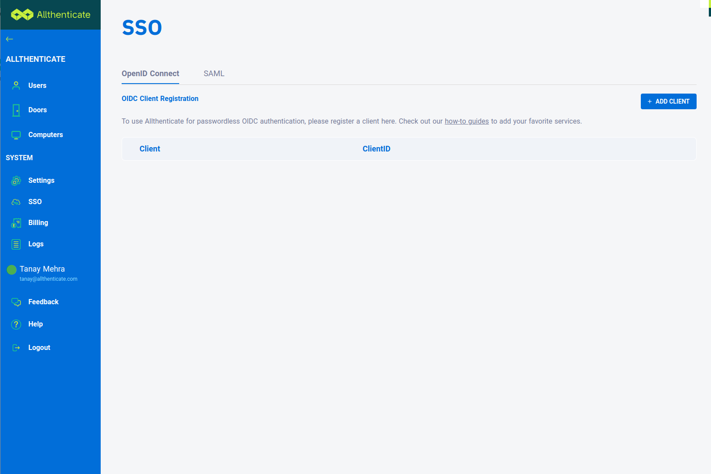
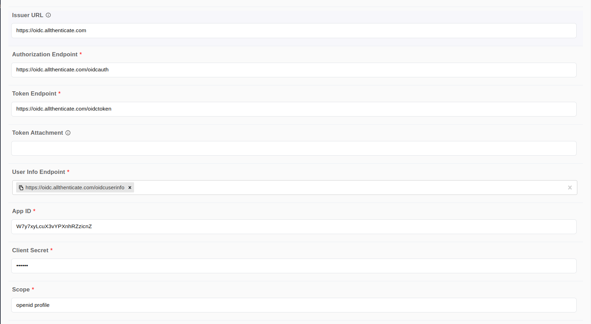

# Allthenticate Connector

Author: Tanay Mehra

# Introduction

Allthenticate’s passwordless OpenID SSO connector is an exciting addition to the Ping marketplace. This connector will integrate seamlessly with your applications in a PingOne DaVinci flow and is greatly customizable to fit your needs. It is easy to setup and use, and does away with passwords to make a user sign-in process incredibly simple and hassle free.

# Setup

## Resources

For information and setup help, see the following sections of the Allthenticate documentation:
### Step 1: DaVinci environment

To start off, you will need to log into your DaVinci environment and add the blank, unconfigured Allthenticate OpenID connector. To do this, simply go to your PingOne organization → PingOne services → DaVinci → Connectors → select “Add Connector" and search for Allthenticate.

Once added to the library, click into the Allthenticate connector and copy the Redirect URL. We are going to need that for registration.

### Step 2: Admin portal registration

In another tab or window you'll register your DaVinci environment as a client so that it can use Allthenticate as an external OpenID provider for Single Sign On. Log into the Allthenticate Admin Portal at http://admin.allthenticate.com and go to: SSO → OpenID → Add Client.

When the dialog box pops up, Enter a name for the DaVinci application, set a suitable client URI and choose any combination of the provided scopes based on your application. Note: If you don’t select OpenID as a scope, your flow will be using Oauth2.0 as an authentication scheme.

Now paste the URL from the previous step into the Redirect URI field. Note: As of now, we can only register a single URI. 

Select ‘Code’ as the response type and ‘Authorization code grant’ in grant types.

If you had selected ‘OpenID’ as a scope, you should select ‘Client Secret Basic’ or ‘Client Secret Post’ as your Token endpoint auth method.

Once it looks good, hit the save button! You should receive your client ID. In order to view more details about the registered client such as your client ID, simply click on the row and a pop up dialog will show you all the information you need!

### Step 3: Configure the connector!

Now head back to the DaVinci window, with the OIDC connector open, fill in the following fields:

Issuer URL: https://oidc.allthenticate.com

Authorization Endpoint: https://oidc.allthenticate.com/oidcauth

Token endpoint: https://oidc.allthenticate.com/oidctoken

Userinfo endpoint: https://oidc.allthenticate.com/oidcuserinfo

App ID: <the client ID you received earlier>

Client secret: <The client secret you received earlier or blank>

Scope: <any subset of the scopes you registered with>

Hit save, and you’re done! Now you can freely use Allthenticate to log into services supporting OIDC or Oauth2.0!

## Requirements

To use the connector, you'll need:

* A smartphone with the Allthenticate app installed
* A registered Allthenticate account

## Install the Allthenticate App

If you haven’t already installed the Allthenticator App, make sure to have it installed. 

1. Install the app from either the Google Play Store or the Apple App Store
2. Follow the instructions on the app to register an account and add it to your organization.

## Setting up the connector

In DaVinci, add an Allthenticate connection. For help, see [Adding a connection](https://docs.google.com/document/d/1Sc9tD5tn9dl79qOWup0k3eKk5hrNVI8lZPAdm8loeiA/edit#).

### Connector settings

Note: Before running a flow, click the connector and navigate to the ‘Attribute Mapping’ tab. Make sure that under ‘Allthenticate’ Attributes, there’s a field called ‘sub’, and its equivalent on the ‘DaVinci User Pool Attributes’ is set to username.

# Using the connector in a flow

## Passwordless Single Sign On

On PingOne’s DaVinci menu, set up a new flow for your application.
As a starting point, you can create a basic template, with a ‘Login with Allthenticate button’ showing up on the screen.

Add the Allthenticate connector next and make sure the configuration is correct. 

Finally, add a custom or template HTML page where the user will be redirected to after being successfully authenticated.

Your test flow will run as follows:

Initial User Lookup screen / Sign on screen:
This screen is optional, here the user can have a simple button that takes the user to the Allthenticate Single Sign On page.

Allthenticate’s Single Sign On Page:
Here the user should enter their registered email address or username.

Authentication on your phone:
The user should get an authentication request on their phone. Shortly after, they would be prompted to use their Biometric or enter their Pin to complete the authentication process.

Successful flow
Almost instantly, after the successful authentication the user should be redirected to the success page.
