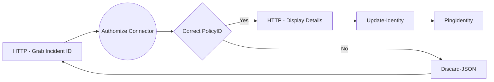

# Authomize Connector

Author: Steven Riley

# Introduction
The Authomize connector is based on the Incident API framework outlined in the Authomize documentation. This framework allows for incident processing and management based on policies identefying issues within your IAM/IdP infratsructure framework. Authomize continuously monitors your identities, access privileges, assets, and activities to secure all your apps, cloud services, and IdPs. Authomize allows organizations to mitigate IAM risk with visibility and granular control across all apps and cloud services (IaaS, SaaS, and Data).

Authomize is a leading provider of Identity Threat Detection and Response (ITDR). ITDR focuses specifically on monitoring and securing IAM solutions. As Identity has become the key to access in the modern workspace, attackers are increasingly targeting SSO, IdP, and IGA solutions, which manage access. With its comprehensive coverage across IaaS, SaaS, and IAM solutions, Authomize is the only solution that can identify and mitigate discrepancies in access privileges across systems, uncover potential vulnerabilities in IAM solutions, and detect threats. Authomize also integrates with IAM solutions to facilitate response and automate remediation.

# Setup
The connector requires a tenant from [Authomize](https://www.authomize.com/) before you can start using the connector. The user will need admin rights or have the Authomize admin create a token that will enable them to access the [Incident API framework](https://api.authomize.com). Ensure that you have your [PingOne connector integration](https://support.authomize.com/hc/en-us/articles/11587652293649-PingOne-Integration-Guide) complete on the Authomize tenant to best utilize the provided Davinci connector. This will ensure you can maximise on any ping policies that create incidents for the workflow you are building.

## Resources
This initial component leverages a couple of simple APIs for use with your workflows, the first is [*Check server access*](https://api.authomize.com/documentation#tag/Status/operation/is_alive_is_alive_get). This simply ensures you can currently reach the server infrastructure. A per the documentation it returns a "True" value if you can reach the API.

The second implementation is [*Get a single incident*](https://api.authomize.com/documentation#tag/Incident/operation/retrieve_incident_v2_incidents__incident_id__get), this enables you to pull all the details about a specific incident, things such as the incident type, the policy it is assigned to and the recommendations along with the descriptions. The following returned JSON demonstrates a partial offboarding event and helps you understand what is happening in your environment which then allows you to build actionable orchestration for identity:

```
{
            "id": "",
            "createdAt": "2023-01-15T09:44:10.235Z", 
            "modifiedAt": "2023-01-15T09:44:10.235Z", 
            "entities": 
            [
                {
                    "id": "a43f28ae7266ddbe95a3dedacebc1d75d7ed0521", 
                    "name": "John Doe",
                    "email": "john.doe@acme.com"
                    "object": "identity"
                }
            ], 
            "apps": 
            [
                {
                    "id": "1441bd5dcf06ddc16a2215fe005fd11365e9e3ce", 
                    "name": "Microsoft Active Directory"
                }
            ], 
            "category": "Change Management", 
            "tactics": 
            [
                "Initial Access", 
                "Defense Evasion"
            ], 
            "compliance": 
            [
                {
                    "id": "isoIec27001", 
                    "name": "ISO/IEC 27001", 
                    "values": 
                    [
                        "A.9.2.1", 
                        "A.9.2.2", 
                        "A.9.2.6", 
                        "A.7.3.1", 
                        "A.8.1.4"
                    ]
                }
            ], 
            "techniques": 
            [
                "Valid Accounts", 
                "Trusted Relationship"
            ], 
            "status": "Open", 
            "severity": "Critical", 
            "policy":
                {
                    "id": "1776235428", 
                    "name": "Partial Offboarding Event, Close All Accounts", 
                    "templateId": "3775535988"
                }, 
                "assigneeId": null, 
            "recommendation": "If this is a case which requires the employee to be Disabled in all systems, make sure the process is completed.", 
            "description": "User John Doe was Disabled in Microsoft, but still enabled in PING_ONE", 
            "isResolved": false, 
            "url": "https://blankdev.authomize.com/incidents/602178f9dfd3335c94a4600a9eb1489d6580466e"
        }
```

Important elements that you would be interested in working with:
  - name: John Doe
  - email: ``` john.doe@acme.com ```
  - Policy
    - id: 1776235428
    - name: Partial Offboarding Event, Close All Accounts
  - recommendation: If this is a case which requires the employee to be Disabled in all systems, make sure the process is completed.
  - description: User John Doe was Disabled in Microsoft, but still enabled in PING_ONE
  - url: ``` https://blankdev.authomize.com/incidents/602178f9dfd3335c94a4600a9eb1489d6580466e ```

Lets look at the specifics:
  - First you need to identfy the policy you are looking for, so the name of the policy is important here. In any sort of flow you will base the action on the policy name. In this case the partial offboarding event would cause maybe one of two actions, first might be to notify the correct people that there is an issue that needs their attention. The second option would be to attempt to disable the user account within Ping One as indicated should be done in the JSON.
  - Recommendation and Description are really just useful display fields to help human beings understand what is going on.
  - URL provides the ability to point back into your Authomize tenant and accesss the incident directly so other activities such as open and close of the incident can be performed.

## Requirements
So what is needed, as indicated before you will need a token to access the API stack within Authomize. Create a token by logging into the Authomize tenant with an admin privelege, then follow these steps:

- click on the **settings** icon found top right of your screen
- On the far left under *Organization Settings* click on **API Tokens**
- Top right click **Create Token** then give it a **name**
- then check the radio button **Platform Token** 
            
Once you click on **Create** you will be presented with the **Token**. Copy the token and save it in a safe place until you are ready to use it. If you make a mistake you can just delete the token key then create another one. The name of the key is not used anywhere, only the actual token ID is used.

## Setting up the connector configuration
Once you have added the Authomize Connector to your flow within Ping-Davinci you must enter the required global configuration which is the token you previously created in Auhomize. Simply grab a copy of that Token ID and click **Configuration** within the connecter and enter the token id value. At this point you can also select the trigger or action from the menu. If you select *Get a single incident* then you will need the incident id. A simple way to get that for testing is to copy one from your Authomize tenant enviroment. You can do this by logging into Authomize tenant and then from the menu on the left drilling down until you find incidents. Then click on an incident an copy the incident number from the URL. Following is an example of what this looks like and the peice you need to copy, its the value between the [ ] brackets:

```
https://blankdev.authomize.com/incidents/[1ec844535eb59cacbaca61d6ddb3678321cdf7ff]?sort=severity&order=desc&filters=%7B%22statuses%22%3A%7B%22values%22%3A%5B%22Open%22%2C%22InProgress%22%2C%22WaitingForInput%22%5D%7D%2C%22isResolved%22%3A%7B%22values%22%3A%5B%22False%22%5D%7D%7D
```
            
### Connector configuration
This connector has a minimal interface to ensure that a customer has the best experience as Authomize is updating its Incident API stack. If while developing you need additional features, please email our support team who will gladly assist and engage the correct team to further add to the code as per any requests made. Please send requests to our support team [Authomize Support](mailto:support@authomize.com?subject=[Authomize-Connector]%20Ping%20Davinci).
            
# Using the connector in a flow
Only a simple flow is supported currently by Authomize, again if you wish to have more features please email us. We will continue to enhance this over time. Using the following design you can make simple decisions on what to do with your Incident data when it arrives. You should work with your Authomize Administrator to determine your Ping policies enabled within Authomize, this will allow you to determine what exact actions you will create.



A specific use case that supports the above proces is leveraging the new /[start with API Integration Method](https://apidocs.pingidentity.com/pingone/main/v1/api/#using-start-with-the-api-integration-method), as this can be leveraged to automatically fire the workflow you create. To do this you will leverage webhooks within Authomize. You must work with your Ping-Davinci contact and request the appropriate components to ensure that this works for your organization. Essentially you will process the incoming JSON as shown [above](#resources). If needed please also contact [Authomize Support](mailto:support@authomize.com?subject=[Authomize-Connector]%20Ping%20Davinci) so they can help you congfigure your environment to support this work.

# Capabilities
The Authomize connector provides the ability to pull a specific incident from Authomize. At the moment there isn't any ability to search for a specific event, hence you need to ask the user or collect the incident from another external process. We would expect you to initially build a process that works directly with Authomize from a user perspective and your flow would have an interface to recieve the incident. You can then use that incident to perform some work.
            
# Troubleshooting
The following are the main problems that could occur:
 - Check the Token used and ensure it is applied to the Authomize Connector (*Remember once you create a token you will not see it again*).
 - Ensure you capture the correct Incident ID from the URL as [shown above](#setting-up-the-connector-configuration).

Any issues with the Authomize Connector please reach out to [Authomize Support](mailto:support@authomize.com?subject=[Authomize-Connector]%20Ping%20Davinci).
            
# Limitations
There are no known limitations with the current implementation, however feel free to reach out with more suggestions.
            
# Release notes
This is release 1.0 and includes the [retrieve incident API](https://api.authomize.com/documentation#tag/Incident/operation/retrieve_incident_v2_incidents__incident_id__get).
