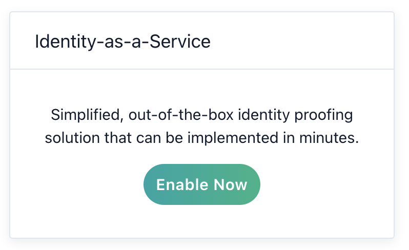
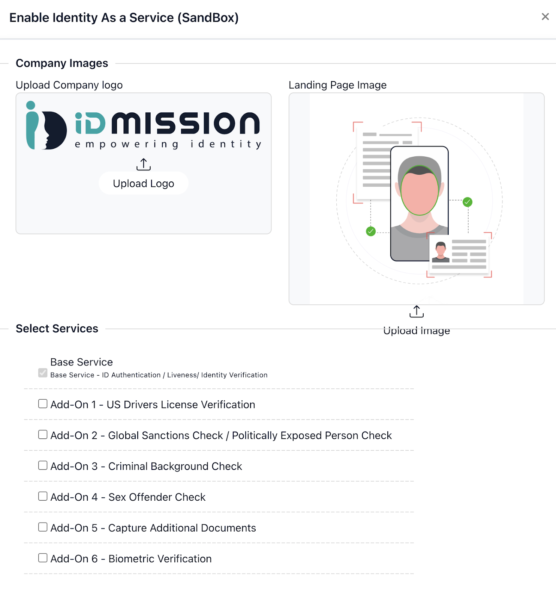
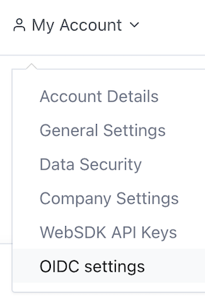
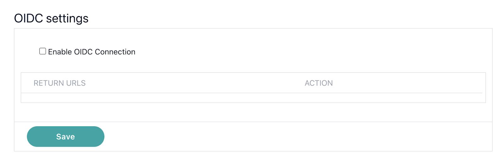
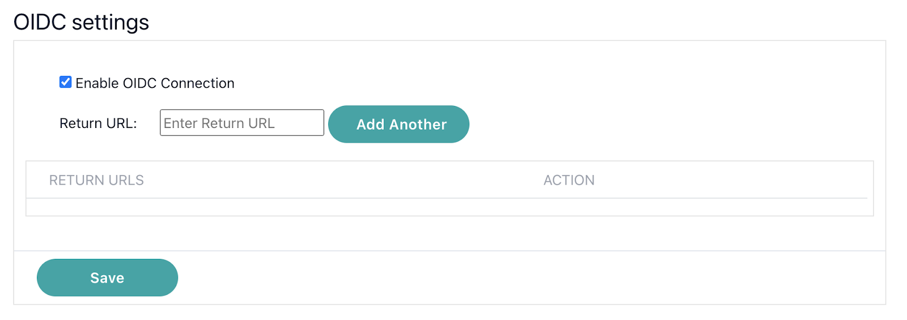
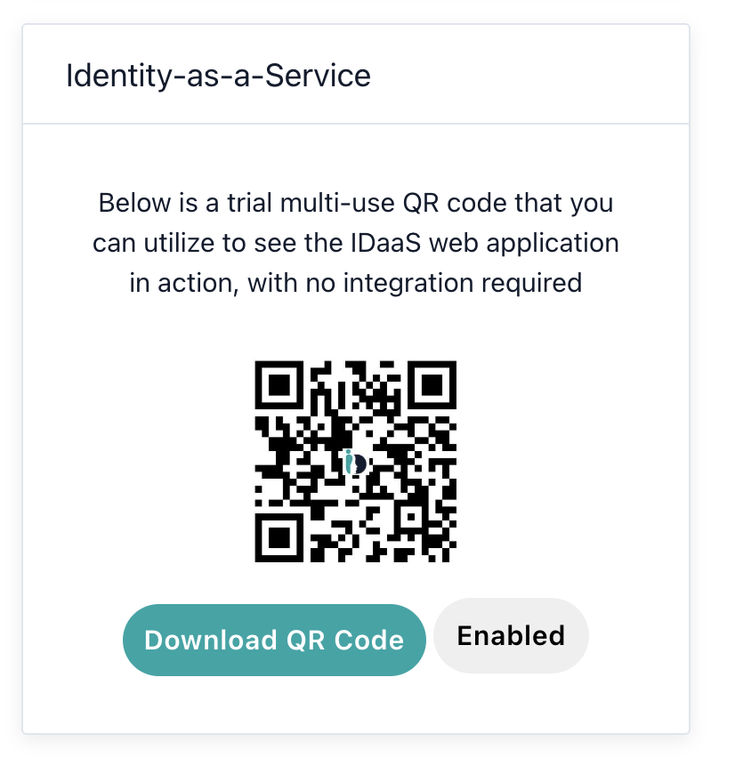

# IDmission OIDC Connector

Author: IDmission LLC

# Introduction

The IDmission connector adds facial biometric identification to IAM onboarding and password reset workflows.  IDmission verifies live human presence during a selfie capture, scans and verifies integrity of a government issued identity document, and then uses facial biometrics to match the human to the document. For returning visitors, access requests are verified by a simple selfie process with built in, certified liveness checking.

# Setup

1. Signup for an account at: https://identity.idmission.com/identity/index.action

2. Enable Identity as a Service - this will generate a QRCode that will be used via the IDmission Connector on Ping.

   

3. In the popup that follows you will be able to upload your Company Logo and a Landing page graphic. Examples are shown in the image below.

   

4. Go to MyAccount -> OIDC Settings

   

Check the Enable OIDC Connection box

   

Enter the Return URL (from Ping Identity). Save your work.

   

## Resources

Please reference the IDmission documentation: https://identity.idmission.com/identity/index.action

## Requirements

To use the connector, you'll need:

An account on https://identity.idmission.com/  
A return URL from Ping Identity entered into the OIDC settings on the IDmission Identity page.

# Using the connector in a flow

You can use the connector in a variety of use cases, such as:

1. Adding a physical human identity to the IAM onboarding process.
  a. A QR Code is presented to the user
  b. Scanning the QR code initiates a user journey that
    i. Enables the user to autoscan a government issued ID document
    ii. Enables the user to auto capture a selfie - with liveness check
    iii. Matches the human face to the face image on the document
  c. Returns the result of the biometric match process to you over PING
2. Adding a physical human identity to the password recovery/reset process
  a. A QR Code is presented to the user
  b. Scanning the QR code initiates a user journey that
    i. Enables the user to auto capture of a selfie - with liveness check
    ii. Matches the Human face to the face record on file (stored during the original onboarding process)

You can choose to verify physical human identity from your users at any point using the IDmission Connector

# Capabilities

## Redirect to IDmission

This capability performs a standard OIDC redirect to IDmission

Reporting Portal

Records of all physical identity onboardings or verifications are available to you on the Identity portal https://identity@idmission.com

## Troubleshooting resources
On the Identity Portal (https://identity@idmission.com) click on the Support section. This will open a trouble ticket and IDmission will respond to address it promptly.

### Testing capabilities

You can test each capability individually.

1. Sign in to https://identity@idmission.com

   

2. Scan the QR Code and the end user journey will be launched on your phone using a web app.
3. See the results on the Identity portal https://identity@idmission.com
