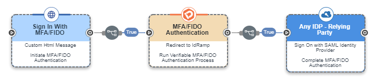
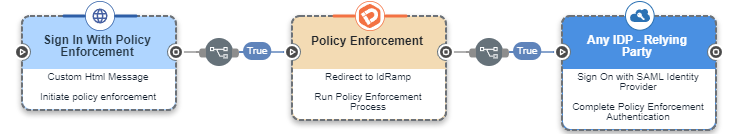

# IdRamp Connector

## Doc draft

Author: Karl Kneis, IdRamp

# Introduction
This connector lets you use IdRamp verification, authentication, and cloud integration services within your PingOne Divinci flows. The IdRamp connector supports a wide range of verification, authentication and cloud integration capabilities including:

Identity proofing and verification
Biometric authentication
Multi-Factor authentication
FIDO authentication
Verifiable credential creation, issuance, and authentication
Multi-cloud policy enforcement
Automated identity provider failover
Multi-vendor cloud integration - Ping, Azure, Google, AWS, Oracle and more

# Setup
## Resources

For information and setup help, see the following documentation:

DaVinci documentation:
Adding a connector
Using DaVinci flow templates

## Requirements

To use the connector, you'll need:

IdRamp connector account - (provided by an IdRamp representative)

## Setting up the connector

Add the IdRamp CLEAR connector in DaVinci as shown in Adding a connector, then configure it as follows.

### Connector settings

To obtain the following information, please speak to an IdRamp representative.

Issuer URL
Issuer URL provided to you by IdRamp.

Authorization Endpoint
Issuer URL provided to you by IdRamp.

Token Endpoint
Token Endpoint provided to you by IdRamp.

User Info Endpoint
User Info Endpoint provided to you by IdRamp.

Client ID
Client ID provided to you by IdRamp.

Client Secret
Client Secret provided to you by IdRamp.

# Using the connector in a flow

You can use the connector in a variety of use cases, such as:

## Use Case: Add CLEAR identity verification proofing to any authentication or business process flow

This sequence will fortify security with a frictionless, reusable identity verification process that will adapt to any PingOne DaVinci flow. CLEAR Verification options include:

Document Verification:Confirm authenticity of thousands of document formats, such as driver’s licenses and domestic and international passports. CLEAR matches facial biometrics to the picture on the I.D. and uses liveness detection to reduce identity spoofing.

Credentials Verification: Verify the user’s identity and qualifications across a number of credentials.

Phone Verification: Verify name and phone number across device carriers and other sources.

Database Verification: Enhance protection with supplementary database checks, such as AAMVA, for biographical details, like address verification.

IAL- 2 : Support NIST 800-63-3 Identity Assurance Level 2 for partners that require the highest level of fidelity; verify once and establish your NIST-compliant enrollment.

## Use Case: Sign-in with CLEAR identity proofing verification 
This sequence will enable passwordless, CLEAR verified authentication into any relying party services or identity providers.

## Use Case: Sign-in with Biometrics

## Use Case: Sign-in with Verifiable Credentials

## Use Case: MFA/FIDO Authentication

## Use Case: Sign-in with Policy Enforcement

# Capabilities

Leave this section blank: it will be generated automatically

## Troubleshooting resources

For technical support please submit a request to the IdRamp service desk

