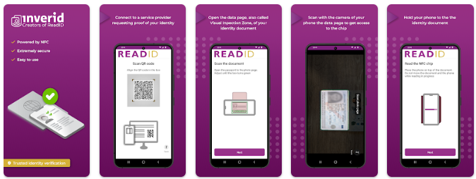

# ReadID by Inverid Connector

Author: Inverid

#Introduction
The ReadID DaVinci Connector enables you to verify NFC chipped passports and identity documents. You can use the ReadID DaVinci Connector in onboarding, account recovery and/or step-up authentication flows. ReadID will return detailed results on document data integrity, authenticity and anti-cloning checks, alongside official data embedded in the chip, such as name, date of birth, and document number. It will also provide the high-resolution face image direct from the chip that is a high-quality reference for subsequent face matching processes.
ReadID comprises a SaaS backend for verification operations and mobile application to interface with users' document chips through NFC.
Reading NFC chips requires native access to APIs on Android and iOS. The Ping Davinci connector uses the ready-to-use ReadID Ready app from Inverid, enabling quicker integration than using mobile SDKs. You do not need to have your own native app to get started.
iOS users can benefit from ReadID Ready App Clips, which eliminate the need for users to install from the App Store and create a seamless user experience.

# Setup
## Resources
For information, see the following Inverid documentation:
*   Trusted-identity-verification - what are NFC chips and how do they work
*   ReadID Ready - overview and animation/screen recording on ReadID Ready
*   Privacy Policy for ReadID Ready
*   ReadID Ready FAQ - for users using ReadID Ready
*   Inverid certifications
See the following for general DaVinci documentation:
*   Adding a connector
*   Using DaVinci flow templates

# Requirements
To use the ReadID DaVinci Connector, you'll need:
* An Inverid ReadID license (sandbox)
* Your ReadID application credentials (Submitter and Viewer keys), and hostname (all via Inverid)
  
## Talk to an expert and setting up ReadID DaVinci Connector
Production license holders can follow the instructions in their ReadID document portal.

Sandbox users will need to contact Inverid to obtain sandbox credentials:
https://www.inverid.com/ping-identity-davinci-connector

## Configuring the ReadID DaVinci Connector
Add the ReadID DaVinci Connector in PingOne DaVinci as shown in Adding a connector, then configure it as follows

### ReadID DaVinci Connector configuration

1. For ReadID Davinci Sandbox users.
Find the Redirect Webhook URI and copy the string. You will need to send this to your Inverid onboarding contact so the ReadID sandbox can be configured.
 Example: https://auth.pingone.com/231478912347891247891247891247
2. Inverid will then provide API Keys in return. You will need to add these keys in the configuration page.

Add ReadID Submitter API Key:
 Example: 123-456-789
Add ReadID Viewer API Key:
 Example: 123-456-789
Add ReadID Hostname:
 Example: readid.davinci.connector.com
 Time to live for ReadySession:
 Set between 30 and 72000

# Using the connector after configuration
Inverid has built an example Davinci web flow that simply initiates a session and returns the results.

On request Inverid can supply a sample ReadID Davinci Connector, please contact your Inverid onboarding contact.

## Start the flow

Download the ReadID Ready App on the play/app store:

 

Scan the QR code generated by the ReadID Davinci Connector with the app ReadID Ready:

## Start the ReadID session
Follow the instructions in ReadID ready:

## Wait for Session Review Result
Wait for ReadID to send the result of a document verification check to the ReadID DaVinci Connector webhook.
Results from the document NFC chip:

Face image from the document NFC Chip:

# ReadID Davinci Connector output schema
## API Access levels
All APIs are marked with an annotation for the output schema . This label defines the development status and/or access level. Some APIs are available for technical reasons but are considered internal and for ReadID use only. The same information is also available in this API documentation. but the labels in the actual schema are always leading.

Label:
 EXTERNAL For features and/or API parts that can be used by customers using the ReadID Davinci Connector.
 INTERNAL For features and/or API parts that are for internal, i.e. ReadID, use only. As such these features may change between ReadID versions without notification.
 BETA For features and/or API parts which are still in development. These features may change between ReadID versions without notification.

| Output              | Info | Label |
| :---------------- | :------: | ----: |
| rawResponse        |   The rawResponse of the output   | INTERNAL |
| statusCode           |   Status code   | INTERNAL |
| header    |  Header Request   | INTERNAL |
| app |  Application related data   | INTERNAL |
| chip |  Chip related information sent by the application. This is an opaque identifier that identifies a specific client application. On Android the package name of the application is used   | EXTERNAL |
| clientId | Unique identifier for client   | INTERNAL |
| consolidatedIdentityData |  Identity data consolidated from different sources applicable for this session   | EXTERNAL |
| creationDate |  Date when this session was created. Timestamp on the moment when the session was inserted into the database   | EXTERNAL |
| deviceId |  Unique identifier for a specific device. This value is asserted by the SDK and is on a reasonable effort basis. This value can be used to link multiple ReadID sessions to the same device.   | EXTERNAL |
| deviceInfo |  Device related data   | INTERNAL |
| documentContent |  Interpreted data captured from the document chip using NFC technology  | EXTERNAL |
| expiryDate |  Date when this session will be purged from the database. Once this point in time has been passed, the ReadID session will be permanently deleted.   | EXTERNAL |
| iProovSession |  Face recognition data   | INTERNAL |
| lib |  Library related data  | INTERNAL |
| nfcSession |  Raw data captured from the contactless chip  | INTERNAL |
| vizImages |  Images from the Visual Inspection Zone (VIZ)   | INTERNAL |

 

