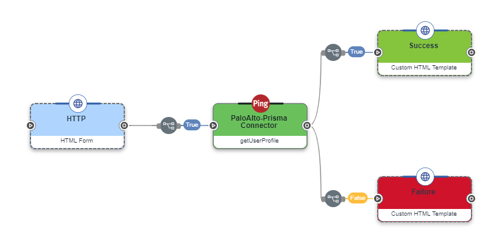
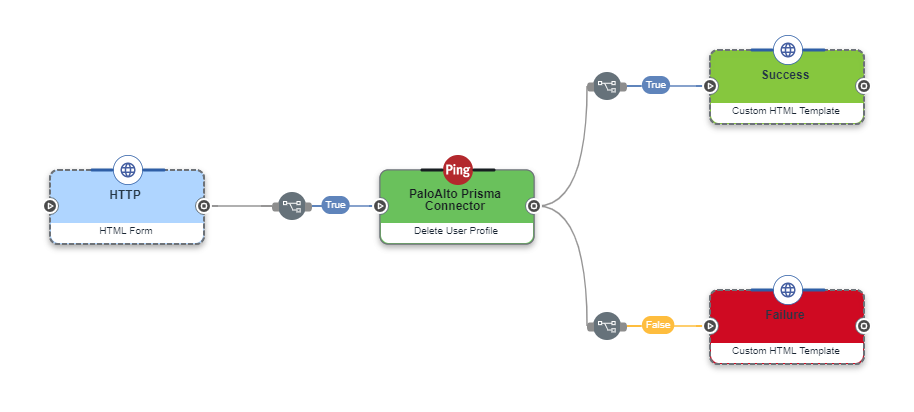

# PaloAlto Prisma Connector

## Doc draft

Author:

# Introduction

PaloAlto Prisma Connector can be used to manage Prisma Cloud user profiles. This connector allows you to:

1. Add User Profile
2. Get User Profile Details
3. Update User Details
4. Delete User Profile
5. List SSO Bypass Allowed Users

# Setup

## Resources

For information and setup help, see the following sections of the PaloAlto Prisma documentation:

- [Generate Token](https://api3.prismacloud.io/login)
- [Add User Profile](https://prisma.pan.dev/api/cloud/cspm/user-profile#operation/add-user-v2)
- [Get User Profile Details](https://prisma.pan.dev/api/cloud/cspm/user-profile#operation/get-user-profile-v2)
- [Update User Details](https://prisma.pan.dev/api/cloud/cspm/user-profile#operation/update-profile-v2)
- [Delete User Profile](https://prisma.pan.dev/api/cloud/cspm/user-profile#operation/delete-user)
- [List SSO Bypass Allowed Users](https://prisma.pan.dev/api/cloud/cspm/user-profile#operation/get-sso-bypass-allowed-users)

## Requirements

To use the connector, you'll need:

- PaloAlto Prisma Account and API Access

## Setting up the connector

In Davinci, add a **PaloAlto Prisma** connection via the "Connections" tab in your Davinci Environment. For help, see [Adding a connection](https://docs.google.com/document/d/1Sc9tD5tn9dl79qOWup0k3eKk5hrNVI8lZPAdm8loeiA/edit#).

### Connector Settings

Once you've added the Palo Alto connection click on it's logo, or click the "···" button and edit. You will see the connector's details pop-up. On the GENERAL tab, enter below details:

1. Prisma Access Key
2. Prisma Secret Key
3. Prisma Base Url

and click apply. This ensures that whenever you use this connector you will not have to reenter this information and token generated using Access Key and Secret Key is used to authorize all capabilities in flow.

# Using the connector in a flow

## Add User Profile

To add a new administrative user add a PaloAlto Prisma Connector in the flow studio. Then choose the Add User Profile capability. Provide the parameters from previous nodes in the flow (HTML form) and submit the details.

## Get User Profile Details

To retrieve the user profile for the specified email ID add a PaloAlto Prisma Connector in the flow studio. Then choose the Get User Profile Details capability. Provide the parameters from previous nodes in the flow (HTML form) and submit the details.

## Update User Details

To update an administrative user's profile add a PaloAlto Prisma Connector in the flow studio. Then choose the Update User capability. Provide the parameters from previous nodes in the flow (HTML form) and submit the details.

## Delete User Profile

To deletes a user or service account profile add a PaloAlto Prisma Connector in the flow studio. Then choose the Delete User capability. Provide the parameters from previous nodes in the flow (HTML form) and submit the details.

## List SSO Bypass Allowed Users

To get list of users who can log in via both SAML provider and username/password flows add a PaloAlto Prisma Connector in the flow studio. Then choose the List SSO Bypass Allowed Users capability.

# Capabilities

### ADD USER PROFILE (addUserProfile)

Create User Profile for Prisma Connector

#### accessKeysAllowed `toggleSwitch`

Access keys allowed

#### Default Role ID `textField` `required`

Default Role ID

#### Email `textField` `required`

Email ID

#### First Name `textField` `required`

First name. Maximum length is 300 characters

#### Last Name `textField` `required`

Last name. Maximum length is 300 characters

#### Role IDs `textField` `required`

Role IDs

#### Time Zone `textField` `required`

string

---

### getUserProfile (getUserProfile)

getUserProfile

#### ID `textField` `required`

User email

---

### Delete User Profile (deleteUserProfile)

Delete User Profile

#### ID `textField` `required`

User email

---

### List SSO Bypass Allowed Users (listSSObypassAlllowedUser)

Returns a list of users who can log in via both SAML provider and username/password flows

---

### Update User Profile (updateUserProfile)

Update User Profile

#### accessKeysAllowed `toggleSwitch`

Access keys allowed

#### Default Role ID `textField` `required`

Default Role ID

#### Email `textField` `required`

Email ID

#### First Name `textField` `required`

First name. Maximum length is 300 characters

#### Last Name `textField` `required`

Last name. Maximum length is 300 characters

#### Role IDs `textField` `required`

Role IDs

#### Time Zone `textField` `required`

string

#### ID `textField` `required`

User email

---

# Limitations

Use of connector is limited by the availability of PaloAlto Prisma API and account access.
