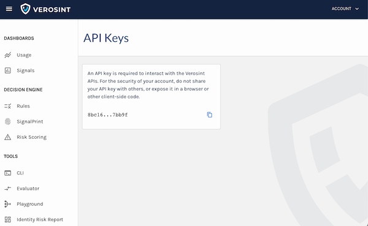

# Verosint Connector

# Introduction

At [Verosint](https://verosint.com/), we help you Stop Account Fraud Before It Starts

User credentials are the highly-coveted targets of bad actors. That’s why companies are turning to Verosint to help deliver trusted online experiences while detecting and preventing account fraud. 

# Setup

To add the connector you will first need to ensure you have an active PingIdentity account and a Verosint account to continue. (Information on how to setup your Verosint account below)

## Resources

+ Verosint documintaion
    - [Product Documentation](https://docs.verosint.com/)
+ DaVinci documentation
    - [Adding a connection](https://docs.pingidentity.com/bundle/davinci/page/srw1637101394177.html)
    - [Importing a flow from the Flow Library](https://docs.pingidentity.com/bundle/davinci/page/kaf1643656046958.html)

## Set up Verosint

To configure the integration with Verosint, follow the steps below:

Head over to [Verosint](https://app.verosint.com/), where you can sign up for an account.

## Setting up the Verosint connector

In DaVinci, add a **Verosint** connection. For help, see [Adding a connection](https://docs.pingidentity.com/csh?context=davinci_adding_a_connection).

### Connector configuration

* **API KEY**: Each time your application makes a request to Verosint, it authenticates with an API key. This API Key can be found in your Account (Account -> API Keys)

## Connector Capabilities
With Verosint and DaVinci, you can protect against fraud in the following ways:

### 1. Send a Successful Login Event
Verosint enables you to evaluate a login or registration event to determine risk to your systems. Each system access attempt typically contains the following information:

<ul>
<li>Account information (Email address, IP address, Phone number).</li>
Time stamp of the event.
<li>Account ID (whatever you use as the unique identifier for this account, such as a username or email address).</li>
<li>User agent (the browser information the account used to access your applications).</li>
</ul>

With multiple events, Verosint can determine potential account sharing or fraud.  The SignalPrints generated from events can be viewed in the Verosint SignalPrint Explorer.

  
### 2. Evaluate a Rule
Verosint offers powerful rules and rule building tools that employ the data that is important in your environment. The amount of open source data that is available can be overwhelming. Knowing your customer-base and access expectations enables you to use only information that is valuable to you. For example, if you want to limit access to users in specific areas, you can create rules based on geography through IP address, internet provider and domain location, or phone number and area code. Or, you may just want to trigger additional security checks in your registration flow if an account is found to be part of a recent data breach. 

Create the rules that are meaningful for your business in the Verosint application under Rules. Then, use the following information to determine if an account meets or violates the criteria of the rule:

<ul>
<li>The rule UUID (generated for each rule created in Verosint).</li>
<li>An email address, or phone number, or IP address for an account.</li>
</ul>

The rule UUID can be found under each rule

  
### 3. Get a Risk Score
With an email address, IP address, or a phone number, Verosint can determine if an account accessing your systems has been found in a recent breach or is a known spam account. A risk score is determined by creating a Risk Score Policy to evaluate users in a login or registration flow for things such as recent data breaches and known spam accounts.

To get a risk score, you will need the API key from the specific risk policy you want to use. This is available in the Verosint application (Risk Scoring -> Create or Find Existing Rule -> Copy API key)

# Using the connector in a flow
Authenticating & Assess users with Verosint Davinci Connector Rule Action

In this flow, an HTML form gathers user data and stores it in variables. First, you will need to create a rule [here](https://app.verosint.com/rules).  You can create your own rule or use one of the provided templates.

Next the connector calls the Verosint Rule endpoint where it will use the the users information and evaluate a rule.  The results are passed to a function that checks for proper response in rule evalution to determine what to do next.
<!-- theme: info -->

> 
>
> Be sure to select the correct identifier for the correct fields. (This is an example and the IP address should come from the global variable)

  
# Troubleshooting

For any issues regarding this integration please contact us via email at [support@verosint.com](mailto:support@verosint.com).
